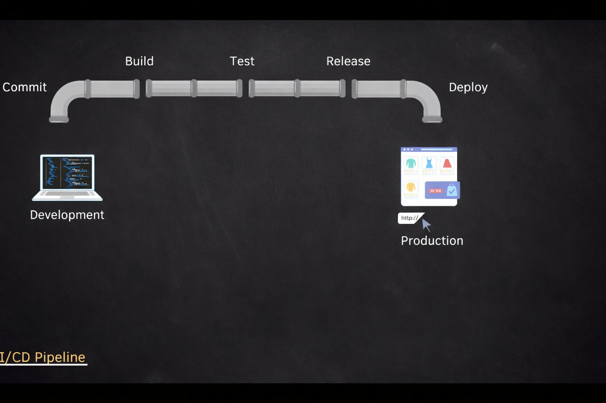
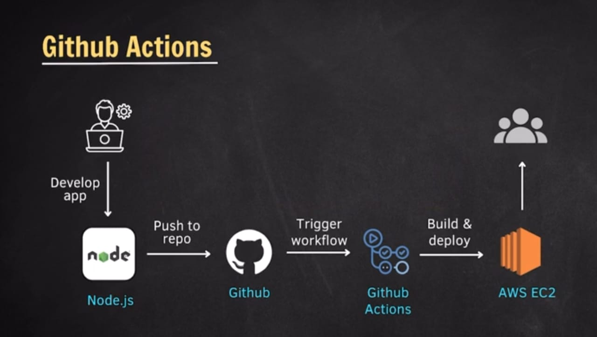

# CI/CD Pipeline

Continious `Integration` 
<!-- build and unit, integeration and regression test -->
Continious `Delivery` (Deployment)
<!-- delever and deploy (without manual approval) -->

<!-- CI/CD is a process that allows you to automate the building, testing, and deployment of your application. -->

*All these processes go though Software Development Life Cycle (SLDC).*



- Deployment Strategies:
    - i. Blue-Green Deployment
    - ii. Canary Deployment

- CI/CD Tools:
    - GitHub Actions → Docker container jobs



`.yml file` is for automation.

`.yml` template

```yml
name: Docker container job

on:
  push:
    branches: [ "main" ]

jobs:
  job_1:

    runs-on: ubuntu-latest
    container: node:20.19.5

    steps:
      - name: My first step
        run: echo "Hello world"
      - name: create new dir
        run: mkdir newFolder
```

<!-- https://docs.github.com/en/actions/reference/workflows-and-actions/workflow-syntax -->
