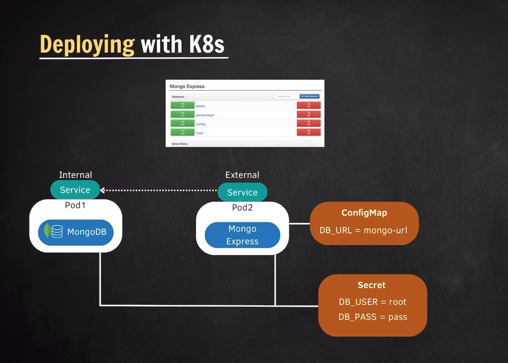
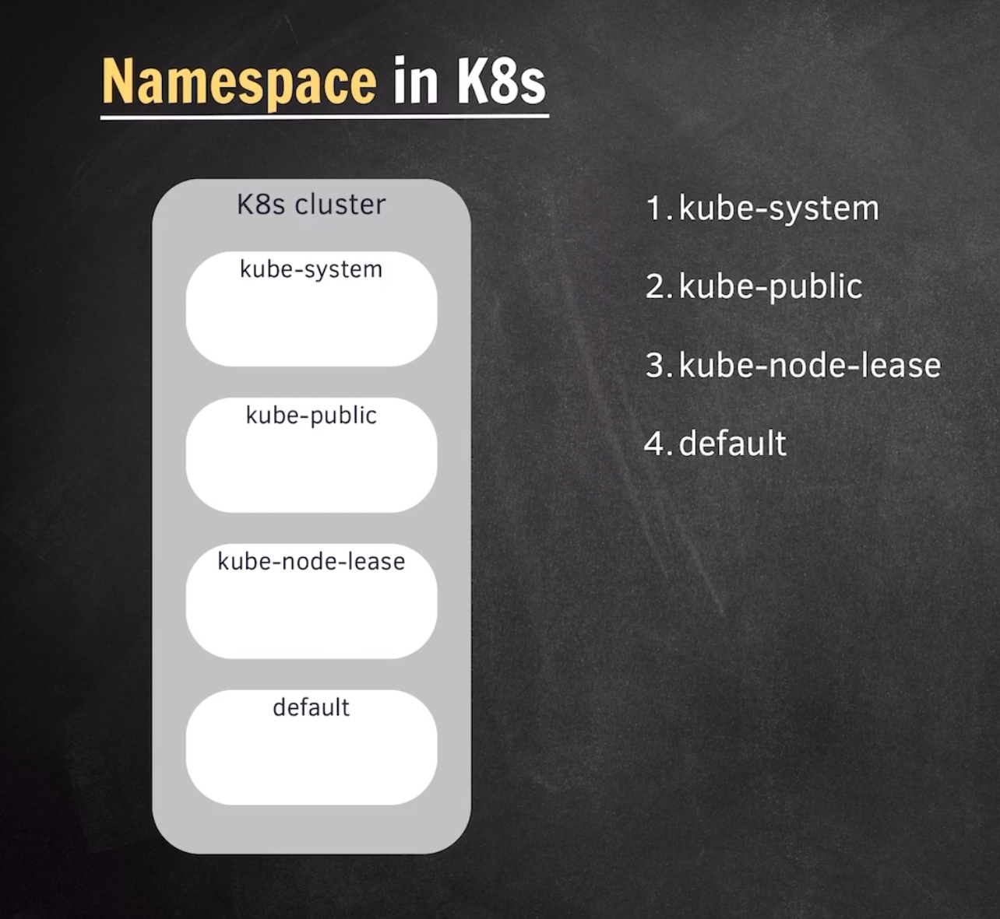

# **_Kubernetes_**

<!-- topics to be covered -->

- `What is Kubernetes?`
  - _it is a container orchestration system._
  - F*eatures:*
    - i. _cloud agnostic._
    - ii. _high availability._
    - iii. _scalability._
    - iv. _reliability._
- `Components - Node & Pod`
  - 
- `Service & Ingress`
  - _Each pod gets a unique IP address._
    
    
  - _`Ingress` - Expose services from outside the cluster._
- `ConfigMap & Secret`
  - 
    - _`ConfigMap` & `Secret` are used to store non-code data._
    - _`ConfigMap` stores configuration data in key-value pairs._
    <!-- - ***use cases**: database credentials,   application configurations* -->
    - _`Secret` stores sensitive data like passwords, tokens,and keys in base64 encoded format._
      <!-- ***use cases**: database credentials, API   keys, certificates* -->
      <!-- Both `ConfigMap` and `Secret` can be mounted as environment variables or volumes inside pods -->

- `Volumes`
  - 
- `Deployment & StatefulSet`
  - 
  - 

  - `K8s Components`
    - _`Node`_ <!-- worker machine in the clustor -->
    - _`Pod`_
    - _`Service`_
    - _`Ingress`_
    - _`ConfigMap`_
    - _`Secret`_
    - _`Volumes`_
    - _`Deployment`_
    - _`StatefulSet`_

- `Kubernetes Architecture`
  - _`Master-Worker Model`_
    - _`Master Node`_
      - _`API Server`_
      - _`Controller Manager`_ <!-- controls the state of the cluster -->
      - _`Scheduler`_ <!-- assigns pods to nodes -->
      - _`etcd`_ <!-- key-value store for cluster state -->
    - _`Worker Node`_
      - _`Container Runtime`_ <!-- Docker -->
      - _`Kubelet`_ <!-- communicates with master node -->
      - _`kube-proxy`_ <!-- manages network routing and forward requests -->
  - 
- `Summary`
- `Local Setup - Minikube & Kubectl`
- `Installation`
- `Kubectl Commands [GET]`
  - ```bash
       #get
        kubectl version --client
        kubectl get -h
        kubectl get nodes # could be either plural or singular e.g., nodes or node.
        kubectl get pods # same goes with this.
        kubectl get pods -o wide # output full details
        kubectl get replicasets # etcd stores this information
        kubectl get services # same goes with this.
        kubectl describe service SERVICE_NAME
        kubectl get deployments # same goes with this.
        kubectl get deployment DEPL0YMENT_NAME -o yaml
        kubectl get secrets
        kubectl get all

      #create
       # kubectl create -h
       # kubectl create deployment -h
       kubectl create deployment [NAME] --image=image[options] # creating a pod, replicaset e.g., nginx

      kubectl set env deployments/[NAME] ENVIRONMENT_VARIABLE=VALUE

      kubectl edit deployment [NAME] # edit the deployment.yaml file. press 'i' for edit, esc for exit, :wq to save and quit.

      # logs & exec
       kubectl logs [POD_NAME] # get the logs of the pod.
       kubectl exec -it [POD_NAME] -- /bin/bash # get inside the pod, accessing the terminal. it stands for interactive terminal
       - ls - list of all directories, pwd - current directory, mysql -u root -p

      # delete
      kubectl delete deplyment [DEPLOYMENT_NAME] # pod is also going to be automatically deleted including replicaset.
      kubectl delete -f FILE_NAME

      # apply
      kubectl apply -f [FILE_NAME]
    ```

    kubectl is the command-line tool for interacting with Kubernetes clusters.

- ### [`Minikube`](https://minikube.sigs.k8s.io/docs/start/?arch=%2Fwindows%2Fx86-64%2Fstable%2F.exe+download) commands
  - ```bash
      minikube start
      minikube status
      minikube dashboard
      minikube pause
      minikube stop
      minikube delete
    ```

  ```
  Minikube is a tool that creates a local Kubernetes cluster on your machine.
  ```

- `Debugging Commands [LOGS & EXEC]`
- `APPLY Command`
- `YAML Configurations`
  <!-- touch nginx-deplyment.yaml
       vim nginx-deplyment.yaml
       i to insert
       :wq to save and exit
       -->
  ```yml
  # configeration of deployment
  apiVersion: app/v1
  kind: Deployment # Service, ConfigMap
  # components i. metadata ii. spec iii. status - which is done automatically
  metadata: # data about data
    name: nginx-deployment # DEPLOYMENT_NAME
    labels:
      app: nginx # foe associating services.
    spec: #specifications
      replica: 1 # 2
      selector:
        matchLabels:
          app: nginx
      template: # configeration of pod
        metadata:
          labels:
            app: nginx
        spec:
          containers:
            - name: nginx
              image: nginx:1.24
              ports:
                - containerPort: 5000
  ```


```bash
kubectl apply -f nginx-deplyment.yaml
kubectl delete -f nginx-deplyment.yaml
rm nginx-deplyment.yaml
````

<!-- nginx-service.yaml -->

```yml
# configeration of services
apiVersion: v1
kind: Services
metadata:
  name: nginx-service
  spec:
    selector:
      app: nginx
      port:
        - protocol: TCP
          port: 80 # incooming requests
          targetPort: 5000 # outgoing requests
```

```bash
kubectl delete -f nginx-service.yaml
```


- `Status in Configuration`
- `Deploying mongo-app in K8s`
  - 

  - `steps`
    1. _Create Secret_
    2. _Create Deployment for Mongodb_
    3. _Create Internal Service for Mongodb_
    4. _Create ConfigMap_
    5. _Create Deployment for mongo-express_
    6. _Create External Service for mongo-express_

    

- `Configuring Mongodb`

  ```yml
  # mongo-deplyment.yaml
  apiVersion: apps/v1
  kind: Deployment
  metadata:
    name: mongo-deployment
    labels:
      app: mongodb # label_name
  spec:
    replicas: 1
    selector:
      matchLabels:
        app: mongodb # label_name
    template:
      metadata:
        labels:
          app: mongodb # label_name
      spec:
        containers:
          - name: mongodb # conatiner_name
            image: mongo:4.4 # .latest
            ports:
              - containerPort: 27017
            env:
              - name: MONGO_INITDB_ROOT_USERNAME
                valueFrom:
                  secretKeyRef:
                    name: mongo-secret
                    key: MONGO_INITDB_ROOT_USERNAME
              - name: MONGO_INITDB_ROOT_PASSWORD
                valueFrom:
                  secretKeyRef: # camelCase
                    name: mongo-secret
                    key: MONGO_INITDB_ROOT_PASSWORD
              # Optional: Add storage volume for persistence

  ---
  # mongo-service.yaml
  apiVersion: v1
  kind: Service
  metadata:
    name: mongo-service
  spec:
    selector:
      app: mongodb # label_name
    ports:
      - protocol: TCP
        port: 27017 # incoming requests
        targetPort: 27017 # outgoing requests
  ```

  ```yaml
  # mongo-secret.yaml
  apiVersion: v1
  kind: Secret
  metadata:
    name: mongo-secret # secretKeyRef_name
  type: Opaque # hidden and secret
  data: #encoding
    MONGO_INITDB_ROOT_USERNAME: ZGVsdGEtYWRtaW4NCg== # echo -n 'delta-admin' | base64
    MONGO_INITDB_ROOT_PASSWORD: ZGVsdGEtcGFzc3dvcmQNCg== # echo -n 'delta-password' | base64
  ```

  ```bash
  kubectl apply -f mongo-secret.yaml
  kubectl apply -f mongo-deployment.yaml

  kubectl delete -f mongo-secret.yaml
  kubectl delete -f mongo-deployment.yaml
  ```

  <!-- kubectl get secrets
    kubectl describe service mongo-service
    kubectl describe pod mongo-deployment-6c68b7f895-f6nl6
    -->

- `Configuring Mongo Express`
  - ```yml
      # mongo-express-deployment.yaml
      apiVersion: apps/v1
      kind: Deployment
      metadata:
      name: mongo-express
      labels:
        app: mongo-express # label_name
      spec:
        replicas: 1
        selector:
          matchLabels:
            app: mongo-express # label_name
        template:
          metadata:
            labels:
              app: mongo-express # label_name
        spec:
          containers:
          - name: mongo-express # conatiner_name
            image: mongo-express # .latest
            ports:
            - containerPort: 8081
            env:
            - name: ME_CONFIG_MONGODB_SERVER 
              valueFrom:
                configMapKeyRef:
                  name: mongo-configmap # configMapKeyRef_name
                  key: database-url # Points to "mongo-service"
            - name: ME_CONFIG_MONGODB_ADMINUSERNAME
              valueFrom:
                secretKeyRef: # camelCase
                  name: mongo-secret
                  key: MONGO_INITDB_ROOT_USERNAME
            - name: ME_CONFIG_MONGODB_ADMINPASSWORD
              valueFrom:
                secretKeyRef: # camelCase
                  name: mongo-secret
                  key: MONGO_INITDB_ROOT_PASSWORD
    ---
    # mongo-express-service.yaml
    apiVersion: v1
    kind: Service
    metadata:
      name: mongo-express-service
    spec:
      selector:
        app: mongo-express # label_name
      type: LoadBalancer # ClusterIP
      ports:
        - protocol: TCP
          port: 8081 # incoming requests
          targetPort: 8081 # outgoing requests
          nodePort: 30000 # 30000-32767 browser accessing port internally re-direct to targetPort 8081
    ```
    ```bash
    minikube service mongo-express-service # username: admin, password: pass
    ```
```yml
# mongo-express-configmap.yaml
apiVersion: v1
kind: ConfigMap
metadata:
  name: mongo-configmap # configMapKeyRef_name
data: #encoding
  database-url: mongo-service 

```

```bash
kubectl apply -f mongo-express-configmap.yaml
kubectl apply -f mongo-express-deployment.yaml

kubectl delete -f mongo-express-configmap.yaml
kubectl delete -f mongo-express-deployment.yaml
```


- `Namespace in K8s`
  - 
  - ```bash
      kubectl get namespaces # ns - for short
      kubectl get services -n default
      kubectl cluster-info # info coming from kube-public
      ```
      <!-- 1.i. system related components. 1.ii. not meant for general user. 2.i. publically accessible resouces or components are stored such as cluster related information which doesnt required any authorisation or any authentication.
      3. sub-folders contains information regarding cluster availability and a cluster node's health. 4. default namespace is used for objects that do not have a namespace. -->
- `Namespace Use cases`
  - *Separation of concerns*
  - *Application grouping*
  - *Environment separation*
  - *Versioning*
  - *Security policy*
  - *Resource limits/quotas*
- `Custom Namespaces`
- `Scope`
- `Kubens Installation`
- `Ingress in K8s`
- `Ingress Controller`
- `Configure app with Ingress`
- `Helm - Package Manager`
- `Helm chart structure `

