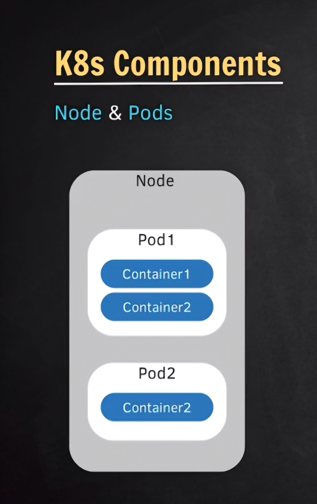
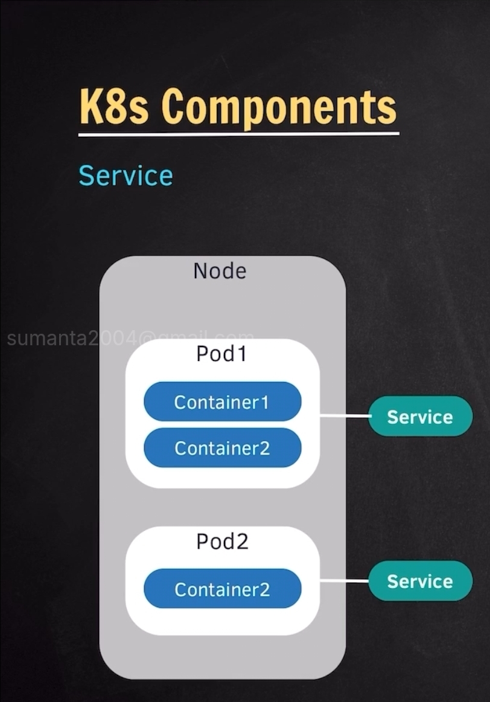
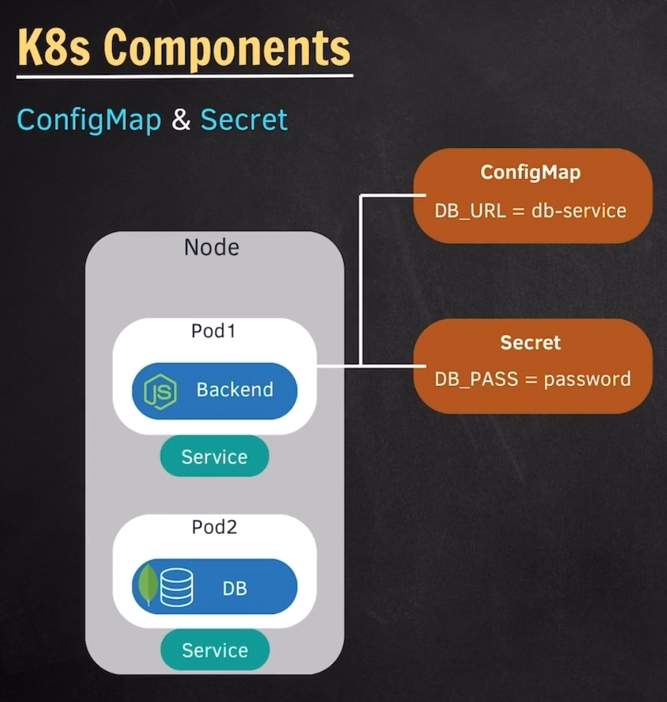
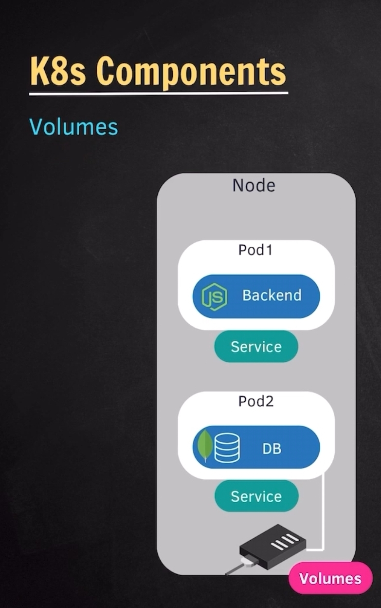
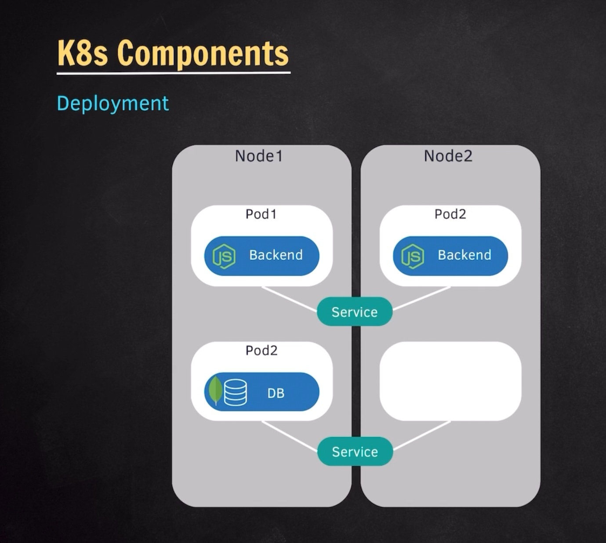
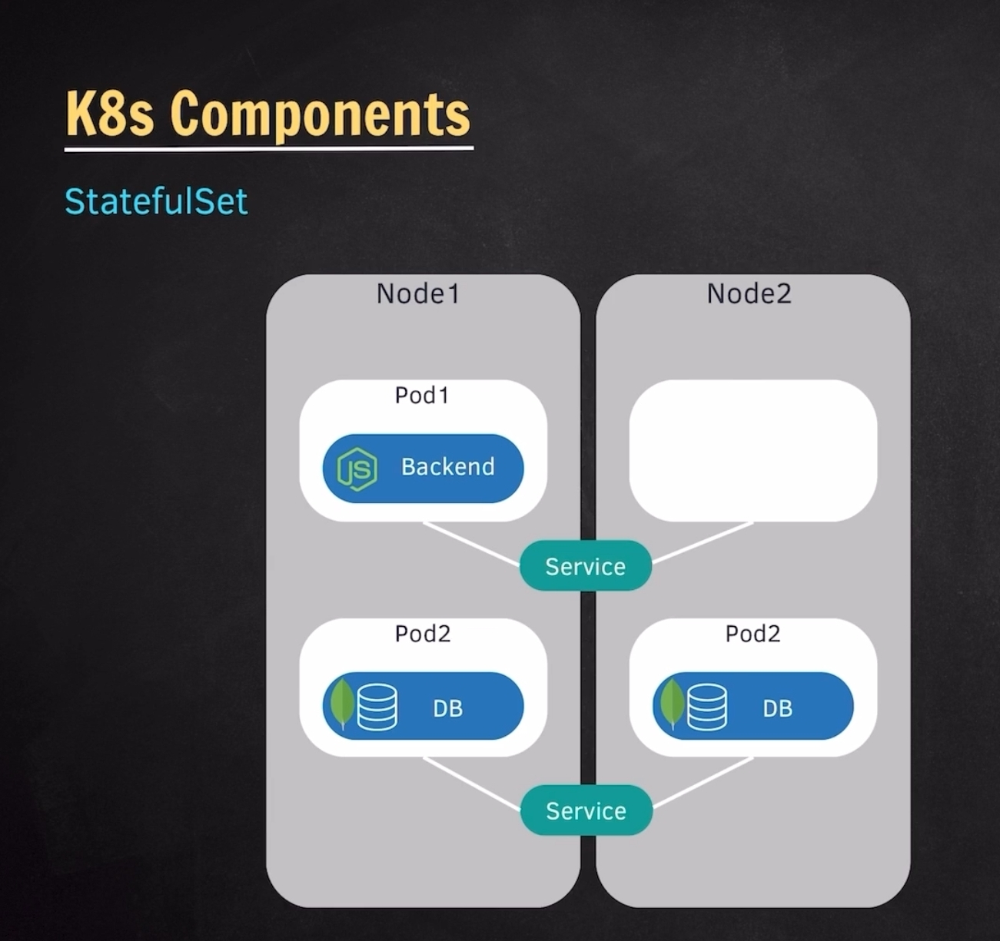
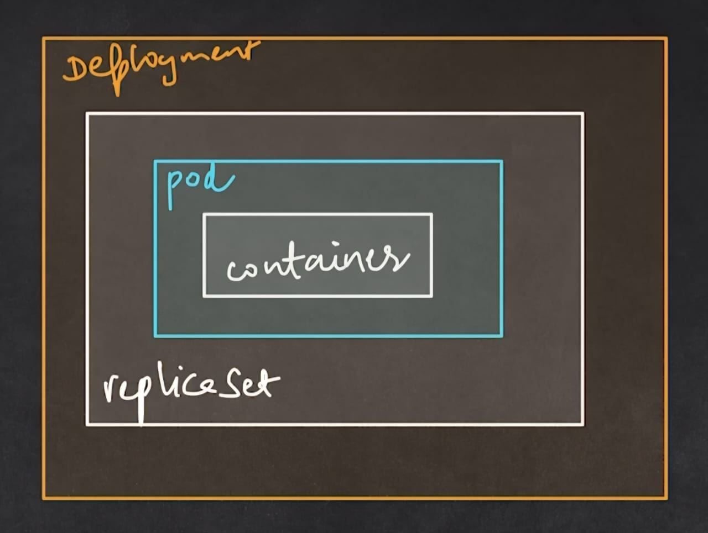
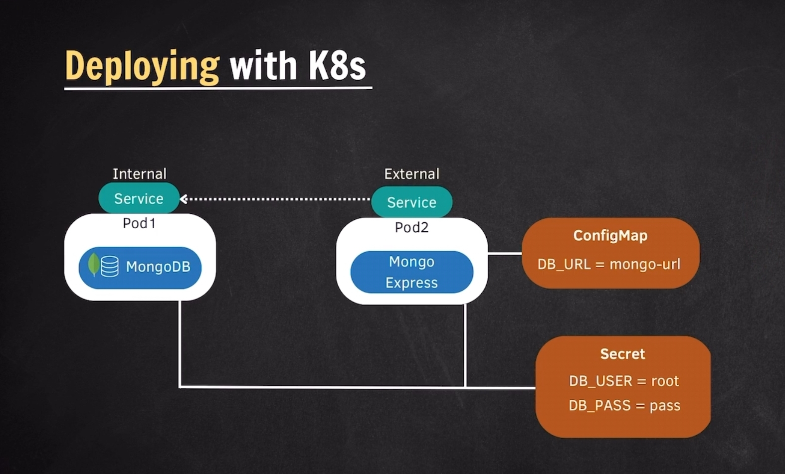
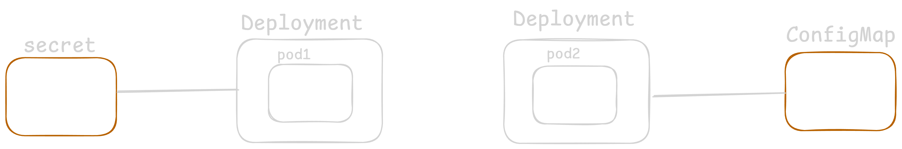

# ***Kubernetes***
<!-- topics to be covered -->
- `What is Kubernetes?`
    - *it is a container orchestration system.*
    - F*eatures:*
        - i. *cloud agnostic.* 
        - ii. *high availability.* 
        - iii. *scalability.* 
        - iv. *reliability.*
- `Components - Node & Pod`
    - 
- `Service & Ingress`
    - *Each pod gets a unique IP address.*
    
    
    - *`Ingress` - Expose services from outside the cluster.*
- `ConfigMap & Secret`
    - 
      - *`ConfigMap` & `Secret` are used to store   non-code data.*
      - *`ConfigMap` stores configuration data in   key-value pairs.*         
      <!-- - ***use cases**: database credentials,   application configurations* -->
      - *`Secret` stores sensitive data like passwords, tokens,and keys in base64 encoded format.*
      <!-- ***use cases**: database credentials, API   keys, certificates* -->
      <!-- Both `ConfigMap` and `Secret` can be mounted as environment variables or volumes inside pods -->

- `Volumes`
   - 
- `Deployment & StatefulSet`
   - 
   - 

   - `K8s Components`
      - *`Node`* <!-- worker machine in the clustor -->
      - *`Pod`* 
      - *`Service`*
      - *`Ingress`*
      - *`ConfigMap`*
      - *`Secret`*
      - *`Volumes`*
      - *`Deployment`*
      - *`StatefulSet`*
- `Kubernetes Architecture`
   - *`Master-Worker Model`*
        - *`Master Node`*
           - *`API Server`* 
            - *`Controller Manager`* <!-- controls the state of the cluster -->
            - *`Scheduler`* <!-- assigns pods to nodes -->
            - *`etcd`* <!-- key-value store for cluster state -->
        - *`Worker Node`*
            - *`Container Runtime`* <!-- Docker -->
            - *`Kubelet`* <!-- communicates with master node -->
            - *`kube-proxy`* <!-- manages network routing and forward requests -->
    - 
- `Summary`
- `Local Setup - Minikube & Kubectl`
- `Installation`
- `Kubectl Commands [GET]`

  - ```bash
       #get
        kubectl version --client
        kubectl get -h
        kubectl get nodes # could be either plural or singular e.g., nodes or node.
        kubectl get pods # same goes with this.
        kubectl get pods -o wide # output full details
        kubectl get replicasets # etcd stores this information
        kubectl get services # same goes with this.
        kubectl describe service SERVICE_NAME
        kubectl get deployments # same goes with this.
        kubectl get deployment DEPL0YMENT_NAME -o yaml
        kubectl get all

      #create
       # kubectl create -h
       # kubectl create deployment -h
       kubectl create deployment [NAME] --image=image[options] # creating a pod, replicaset e.g., nginx

      kubectl set env deployments/[NAME] ENVIRONMENT_VARIABLE=VALUE

      kubectl edit deployment [NAME] # edit the deployment.yaml file. press 'i' for edit, esc for exit, :wq to save and quit.

      # logs & exec
       kubectl logs [POD_NAME] # get the logs of the pod.
       kubectl exec -it [POD_NAME] -- /bin/bash # get inside the pod, accessing the terminal. it stands for interactive terminal
       - ls - list of all directories, pwd - current directory, mysql -u root -p

      # delete
      kubectl delete deplyment [DEPLOYMENT_NAME] # pod is also going to be automatically deleted including replicaset.

      # apply
      kubectl apply -f [FILE_NAME]
    ```
    kubectl is the command-line tool for interacting with Kubernetes clusters.
 - ### [`Minikube`](https://minikube.sigs.k8s.io/docs/start/?arch=%2Fwindows%2Fx86-64%2Fstable%2F.exe+download) commands

    - ```bash
        minikube start
        minikube status
        minikube dashboard
        minikube pause
        minikube stop
        minikube delete
    ```
    Minikube is a tool that creates a local Kubernetes cluster on your machine.*
- `Debugging Commands [LOGS & EXEC]`
- `APPLY Command`
- `YAML Configurations`
<!-- touch nginx-deplyment.yaml
     vim nginx-deplyment.yaml 
     i to insert
     :wq to save and exit
     -->
  ```yml
  # configeration of deployment
  apiVersion: app/v1
  kind: Deployment # Service, ConfigMap
  # components i. metadata ii. spec iii. status - which is done automatically
  metadata: # data about data
    name: nginx-deployment # DEPLOYMENT_NAME
    labels:
      app: nginx # foe associating services.
    spec: #specifications
      replica: 1 # 2
      selector:
        matchLabels:
          app: nginx
      template: # configeration of pod
        metadata:
          labels:
            app: nginx
        spec:
          containers:
          - name: nginx
            image: nginx:1.24
            ports:
            - containerPort: 5000
```
```bash
kubectl apply -f nginx-deplyment.yaml
kubectl delete -f nginx-deplyment.yaml
rm nginx-deplyment.yaml
```
<!-- nginx-service.yaml -->
```yml
# configeration of services
apiVersion: v1
kind: Services 
metadata: 
  name: nginx-service 
  spec: 
    selector:
        app: nginx
        port: 
        - protocol: TCP
          port: 80 # incooming requests
          targetPort: 5000 # outgoing requests
```
```bash
kubectl delete -f nginx-service.yaml
```

- `Status in Configuration`
- `Deploying mongo-app in K8s`

  - 

  - `steps`
    1. *Create Secret*
    2. *Create Deployment for Mongodb*
    3. *Create Internal Service for Mongodb*
    4. *Create ConfigMap*
    5. *Create Deployment for mongo-express*
    6. *Create External Service for mongo-express*

    
- `Configuring Mongodb`
- `Configuring Mongo Express`
- `Namespace in K8s`
- `Namespace Use cases`
- `Custom Namespaces`
- `Scope`
- `Kubens Installation`
- `Ingress in K8s`
- `Ingress Controller`
- `Configure app with Ingress`
- `Helm - Package Manager`
- `Helm chart structure `