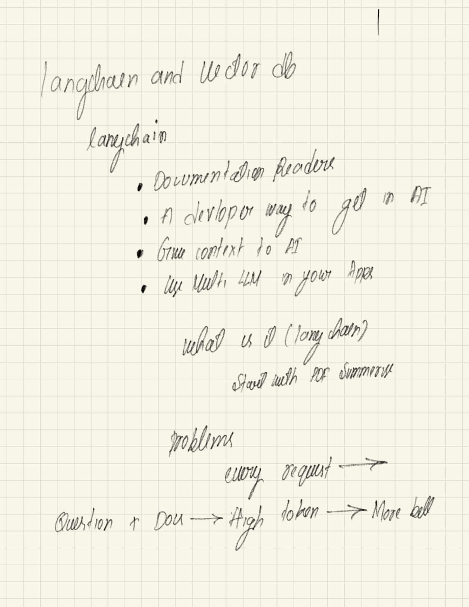
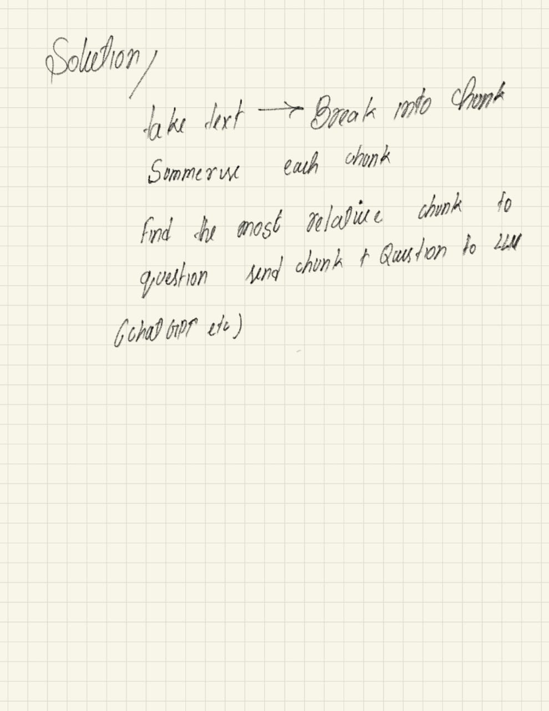
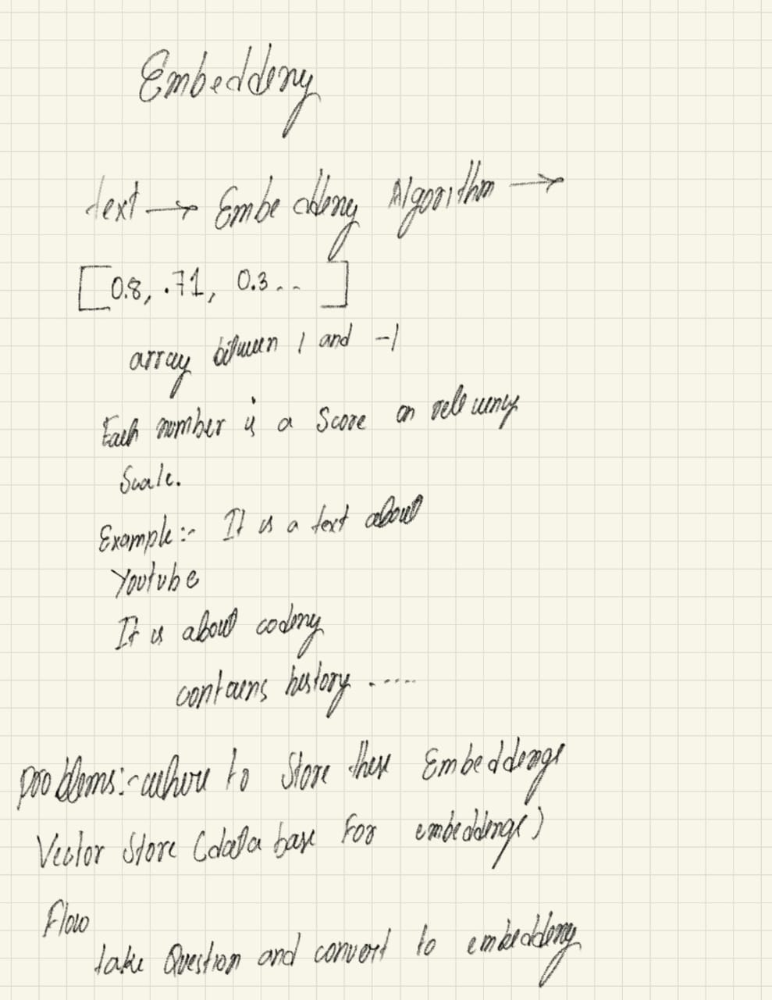

# **What is** <span style="color: #FFD369;">**AI?**</span>


<span style="color: #FFD369;">**AI**</span> is a technology that allows computers or systems to perform task that
typically requires human intelligence.
e.g, 
- i. *Patten Recognition.* 
- ii. *Speach Recognition.* 
- iii. *Image Analysis*

<span style="color: #FFD369;">M</span>L
are those algorithms that learn trained on data rather than programming.

`ML` is a subdomain of `AI`. so, we can say all `ML` is `AI` but `AI` is not `ML` like Rule Based systems.

- `ML` -
  - i. **Linear Regression**, 
  - ii. **Logistic Regression**,
  - iii. **Support Vector Machines,** 
  - iv. **Decision trees**, *etc*.

`Deeplearning is a subdomain of ML.`  - Where we work with neural networks are inspired from human brain. like 
- i. **FNN**(*Forward Neural Networks*), 
- ii. **RNN**(*Recurrent Neural Networks*), 
- iii. **CNN**(*Convonutional Neural Networks*),
- iv. **Transformers**

`GenAI is a subdomain of Deeplearning`

> `GenAI is Genarative AI user for genarting text, images, videos`

<h3 style="
  font-weight: 700;           /* bold for 'Machine' */
  font-size: 4vw;
  text-decoration: underline;
  letter-spacing: 1px;
  line-height: 1.2;
  text-align: left;
  margin: 0;
">
  <span style="color: #FFD369;">Machine</span> <span style="color: #FFFFFF; font-weight: 500;">Learning</span>&nbsp;
</h3>

<p style="
  font-weight: 400;
  font-size: 3vw;
  color: #ffffffa4;
  line-height: 1.5;
  text-align: left;
  margin-top: 0.5em;
">
  <span style="text-transform: uppercase;">ML</span> is the process of teaching computers to learn patterns from data and make decisions based on those patterns.
</p>

```
`ML` *takes input and outputs* → `logic(model)` → *new input* → *output pridictions*
```

<h3 
style="
  font-weight: 700;           /* bold for 'Machine' */
  font-size: 4vw;
  text-decoration: underline;
  letter-spacing: 1px;
  line-height: 1.2;
  text-align: left;
  margin: 0;
">
  <span style="color: #FFFFFF; font-weight: 500; font-weight: bold">ML</span>&nbsp;<span style="color: #FFD369;">Types</span> 
</h3>

- i. <span style="color: #69cbffff;">Supervised</span> Learning
- ii. <span style="color: #69cbffff;">Unsupervised</span> Learning
- iii. <span style="color: #69cbffff;">Reinforcement</span> Learning

<h3 style="
  font-weight: 700;           /* bold for 'Machine' */
  font-size: 4vw;
  text-decoration: underline;
  letter-spacing: 1px;
  line-height: 1.2;
  text-align: left;
  margin: 0;
">
 <span style="color: #FFD369;">Supervised</span>  <span style="color: #FFFFFF; font-weight: 500;">Learning</span>&nbsp;
</h3>
 
 -  Models learn from <span style="color: #2588B5;">labeled</span> data

## Training Data

<table class="styled-table">
  <thead>
    <tr>
      <th>Email Text</th>
      <th>Sender Email</th>
      <th>Link</th>
      <th>Exclamations</th>
      <th>Label</th>
    </tr>
  </thead>
  <tbody>
    <tr>
      <td>"Win a brand new iPhone now! Click the link to claim your prize!"</td>
      <td>promo@fakeste.com</td>
      <td>yes</td>
      <td>2</td>
      <td><strong>spam</strong></td>
    </tr>
    <tr>
      <td>"Dear team, please find the attached report for last quarter."</td>
      <td>manager@company.in</td>
      <td>no</td>
      <td>0</td>
      <td><strong>not spam</strong></td>
    </tr>
    <tr>
      <td>"Cheap meds available!!! Order today and save big."</td>
      <td>sale@pharmacy.in</td>
      <td>yes</td>
      <td>3</td>
      <td><strong>spam</strong></td>
    </tr>
  </tbody>
</table>

<style>
.styled-table {
  width: 100%;
  border-collapse: collapse;
  margin: 25px 0;
  font-size: 0.9em;
  font-family: sans-serif;
  min-width: 400px;
  box-shadow: 0 0 20px rgba(0, 0, 0, 0.15);
}

.styled-table thead tr {
  background-color: #009879;
  color: #ffffff;
  text-align: left;
}

.styled-table th,
.styled-table td {
  padding: 12px 15px;
  border: 1px solid #dddddd;
}

.styled-table tbody tr {
  border-bottom: 1px solid #dddddd;
}

.styled-table tbody tr:nth-of-type(even) {
  background-color: #f3f3f3;
}

.styled-table tbody tr:last-of-type {
  border-bottom: 2px solid #009879;
}

.styled-table tbody tr:hover {
  background-color: #f1f1f1;
  cursor: pointer;
}

.styled-table strong {
  color: #009879;
  font-weight: bold;
}
</style>

`y(function of x(output)) = f(features)(x(input))`

<h3 style="
  font-weight: 700;           /* bold for 'Machine' */
  font-size: 4vw;
  text-decoration: underline;
  letter-spacing: 1px;
  line-height: 1.2;
  text-align: left;
  margin: 0;
">
 <span style="color: #FFD369;">Supervised</span>  <span style="color: #FFFFFF; font-weight: 500;">Learning</span>&nbsp;
</h3>

- i. <span style="color: #69cbffff;">Classification</span> problems
- ii. <span style="color: #69cbffff;">Regression</span> problems

<h3 style="
  font-weight: 700;           /* bold for 'Machine' */
  font-size: 4vw;
  text-decoration: underline;
  letter-spacing: 1px;
  line-height: 1.2;
  text-align: left;
  margin: 0;
">
 <span style="color: #FFD369;">Classification</span>  <span style="color: #FFFFFF; font-weight: 500;">Problems</span>&nbsp;
</h3>

> Classification Problems are those problems where based on the input we map to pre defined categories or classes

* i. `Binary Classification` - *Can be output of 2 values either yes or no*
* ii. `Multiclass Classification` - *When output has more than two categories e,g. Sentiment Analysis*.
<style>
/* Import a large variety of distinct handwriting fonts */
@import url('https://fonts.googleapis.com/css2?family=Brush+Script+MT:wght@400&family=Comic+Sans+MS:wght@400&family=Lucida+Handwriting:wght@400&family=Papyrus:wght@400&family=Segoe+Print:wght@400&family=MV+Boli:wght@400&family=Permanent+Marker&family=Zeyada&family=Gochi+Hand&display=swap');

.digits-table {
  width: 100%;
  border-collapse: collapse;
  margin: 25px 0;
  font-family: Arial, sans-serif;
  box-shadow: 0 0 25px rgba(0, 0, 0, 0.25); /* Enhanced Shadow */
  background: white;
  border-radius: 12px; /* Smoother border */
  overflow: hidden;
}

.digits-table thead th {
  background: linear-gradient(135deg, #667eea 0%, #764ba2 100%);
  color: white;
  padding: 18px; /* Bigger padding */
  text-align: center;
  font-weight: bold;
  font-size: 18px;
  border-bottom: 3px solid #5a6bc4;
}

.digits-table td {
  padding: 22px 10px; /* Increased padding */
  text-align: center;
  border-bottom: 1px solid #e1e1e1;
  font-size: 32px; /* Increased font size */
  font-weight: bold;
  height: 65px;
  vertical-align: middle;
}

/* --- Different Handwriting Styles (Applied to each ROW) --- */
/* Note: Using fallback fonts since custom font loading is often restricted */

.font-style1 {
  font-family: 'Brush Script MT', 'Comic Sans MS', cursive;
  color: #e74c3c; /* Red */
  transform: rotate(-3deg);
  text-shadow: 1px 1px 2px rgba(0,0,0,0.1);
}

.font-style2 {
  font-family: 'Comic Sans MS', cursive;
  color: #27ae60; /* Green */
  transform: rotate(2deg);
  text-shadow: 1px 1px 2px rgba(0,0,0,0.1);
}

.font-style3 {
  font-family: 'Lucida Handwriting', 'Segoe Print', cursive;
  color: #8e44ad; /* Purple */
  transform: rotate(-1deg);
  text-shadow: 1px 1px 2px rgba(0,0,0,0.1);
}

.font-style4 {
  font-family: 'Papyrus', fantasy;
  color: #d35400; /* Dark Orange */
  transform: rotate(4deg);
  text-shadow: 1px 1px 2px rgba(0,0,0,0.1);
}

.font-style5 {
  font-family: 'Segoe Print', cursive;
  color: #16a085; /* Teal */
  transform: rotate(-2deg);
  text-shadow: 1px 1px 2px rgba(0,0,0,0.1);
}

.font-style6 {
  font-family: 'MV Boli', cursive;
  color: #c0392b; /* Dark Red */
  transform: rotate(1deg);
  text-shadow: 1px 1px 2px rgba(0,0,0,0.1);
}

/* --- New Styles Added for Expansion --- */

.font-style7 {
    font-family: 'Permanent Marker', cursive; /* Marker Pen Style */
    color: #34495e; /* Dark Blue/Gray */
    font-size: 34px;
    font-weight: 700;
}

.font-style8 {
    font-family: 'Zeyada', cursive; /* Light, fine pen style */
    color: #f39c12; /* Yellow/Orange */
    font-size: 30px;
    font-weight: 400;
}

.font-style9 {
    font-family: 'Gochi Hand', cursive; /* Fun, chunky handwriting */
    color: #e67e22; /* Medium Orange */
    font-size: 36px;
    font-weight: 400;
}


/* Hover and Striping */
.digits-table tr:hover {
  background-color: #f1f8ff;
  transition: all 0.3s ease;
}

.digits-table tr:nth-child(even) {
  background-color: #fafafa;
}

.digits-table tr:nth-child(even):hover {
  background-color: #e8f4ff;
}

/* Responsive design */
@media (max-width: 768px) {
  .digits-table td {
    padding: 10px 5px;
    font-size: 20px;
  }
}

</style>


<h1>Handwritten Digits Dataset</h1>


<table class="digits-table">
  
  <tbody>
    <tr>
      <td class="font-style1">0</td>
      <td class="font-style1">1</td>
      <td class="font-style1">2</td>
      <td class="font-style1">3</td>
      <td class="font-style1">4</td>
      <td class="font-style1">5</td>
      <td class="font-style1">6</td>
      <td class="font-style1">7</td>
      <td class="font-style1">8</td>
      <td class="font-style1">9</td>
    </tr>
    <tr>
      <td class="font-style2">0</td>
      <td class="font-style2">1</td>
      <td class="font-style2">2</td>
      <td class="font-style2">3</td>
      <td class="font-style2">4</td>
      <td class="font-style2">5</td>
      <td class="font-style2">6</td>
      <td class="font-style2">7</td>
      <td class="font-style2">8</td>
      <td class="font-style2">9</td>
    </tr>
    <tr>
      <td class="font-style3">0</td>
      <td class="font-style3">1</td>
      <td class="font-style3">2</td>
      <td class="font-style3">3</td>
      <td class="font-style3">4</td>
      <td class="font-style3">5</td>
      <td class="font-style3">6</td>
      <td class="font-style3">7</td>
      <td class="font-style3">8</td>
      <td class="font-style3">9</td>
    </tr>
    <tr>
      <td class="font-style4">0</td>
      <td class="font-style4">1</td>
      <td class="font-style4">2</td>
      <td class="font-style4">3</td>
      <td class="font-style4">4</td>
      <td class="font-style4">5</td>
      <td class="font-style4">6</td>
      <td class="font-style4">7</td>
      <td class="font-style4">8</td>
      <td class="font-style4">9</td>
    </tr>
    <tr>
      <td class="font-style5">0</td>
      <td class="font-style5">1</td>
      <td class="font-style5">2</td>
      <td class="font-style5">3</td>
      <td class="font-style5">4</td>
      <td class="font-style5">5</td>
      <td class="font-style5">6</td>
      <td class="font-style5">7</td>
      <td class="font-style5">8</td>
      <td class="font-style5">9</td>
    </tr>
    <tr>
      <td class="font-style6">0</td>
      <td class="font-style6">1</td>
      <td class="font-style6">2</td>
      <td class="font-style6">3</td>
      <td class="font-style6">4</td>
      <td class="font-style6">5</td>
      <td class="font-style6">6</td>
      <td class="font-style6">7</td>
      <td class="font-style6">8</td>
      <td class="font-style6">9</td>
    </tr>
    <tr>
      <td class="font-style7">0</td>
      <td class="font-style7">1</td>
      <td class="font-style7">2</td>
      <td class="font-style7">3</td>
      <td class="font-style7">4</td>
      <td class="font-style7">5</td>
      <td class="font-style7">6</td>
      <td class="font-style7">7</td>
      <td class="font-style7">8</td>
      <td class="font-style7">9</td>
    </tr>
    <tr>
      <td class="font-style8">0</td>
      <td class="font-style8">1</td>
      <td class="font-style8">2</td>
      <td class="font-style8">3</td>
      <td class="font-style8">4</td>
      <td class="font-style8">5</td>
      <td class="font-style8">6</td>
      <td class="font-style8">7</td>
      <td class="font-style8">8</td>
      <td class="font-style8">9</td>
    </tr>
    <tr>
      <td class="font-style9">0</td>
      <td class="font-style9">1</td>
      <td class="font-style9">2</td>
      <td class="font-style9">3</td>
      <td class="font-style9">4</td>
      <td class="font-style9">5</td>
      <td class="font-style9">6</td>
      <td class="font-style9">7</td>
      <td class="font-style9">8</td>
      <td class="font-style9">9</td>
    </tr>
  </tbody>
</table>


<h3 style="
font-weight: 700;           /* bold for 'Machine' */
  font-size: 4vw;
  text-decoration: underline;
  letter-spacing: 1px;
  line-height: 1.2;
  text-align: left;
  margin: 0;
">
 <span style="color: #fff;">Some</span>
 <span style="color: #FFD369;">Classification</span>  <span style="color: #fff; font-weight: 500;">Problems</span>&nbsp;
</h3>

- Linear Classifiers
- Logistic Regression
- K-Nearest Neighbour (KNN)
- Support Vector Machine (SVM)
- Random Forest
- XG Boost

<h3 style="
  font-weight: 700;           /* bold for 'Machine' */
  font-size: 4vw;
  text-decoration: underline;
  letter-spacing: 1px;
  line-height: 1.2;
  text-align: left;
  margin: 0;
">
 <span style="color: #FFD369;">Supervised</span>  <span style="color: #fff; font-weight: 500;">Learning</span>&nbsp;
</h3>

- ii. <span style="color: #2588B5;">regression</span> problems

> `Regression are the problems where we try to predict numerical algorithm`

> `Y =f(x)`*(depended variable will be some fuinction of the independed variable)* : *here the input (x) is independed variable and output(y) is depended variable*

<h3 style="font-weight: 700;           /* bold for 'Machine' */font-size: 4vw;text-decoration: underline; letter-spacing: 1px; line-height: 1.2; text-align: left; margin: 0;
">
 <span style="color: #fff;">Some</span>  
 <span style="color: #FFD369;">Regression</span>  <span style="color: #fff; font-weight: 500;">Algorithms</span>&nbsp;
</h3>

- Linear Regression
- Lasso Regression
- Multi-variate Regression

<h3 style="font-weight: 700;           /* bold for 'Machine' */font-size: 4vw;text-decoration: underline; letter-spacing: 1px; line-height: 1.2; text-align: left; margin: 0;
">
 <span style="color: #FFD369;">Unsupervised</span>  <span style="color: #fff; font-weight: 500;">Learning</span>&nbsp;
</h3>

> Models learn from <span style="color: #2588B5;">unlabled</span> data

- i. **Clustering Problems**
     - i.i. *Partitional Clustering*
     - i.ii. *Hirarchical Clustering*
- ii. **Association Problems** - `we try to find relationships between different entities`. *e.g., ii.i. Market Basket Analysis.*

<h3 style="font-weight: 700;           /* bold for 'Machine' */font-size: 4vw;text-decoration: underline; letter-spacing: 1px; line-height: 1.2; text-align: left; margin: 0;
">
<span style="color: #fff; font-weight: 500;">Some</span>
 <span style="color: #FFD369;">Unsupervised</span>  <span style="color: #fff; font-weight: 500;">Algorithms</span>&nbsp;
</h3>

- *K-means Clustering*
- *Hirarchical Clustering*
- *PCA(Principal Component Analysis)*
- *DBSCAN*

<h3 style="font-weight: 700;           /* bold for 'Machine' */font-size: 4vw;text-decoration: underline; letter-spacing: 1px; line-height: 1.2; text-align: left; margin: 0;
">
 <span style="color: #FFD369;">Reinforcement</span>  <span style="color: #fff; font-weight: 500;">Learning</span>&nbsp;
</h3>

In RL, an agent learns to make decisions by interacting with an environment, recieving 
<span style="color: #2588B5;">rewards</span>
or
<span style="color: #2588B5;">unlabled</span> for its actions.


<h3 style="font-weight: 700;           /* bold for 'Machine' */font-size: 4vw;text-decoration: underline; letter-spacing: 1px; line-height: 1.2; text-align: left; margin: 0;
"><span style="color: #fff; font-weight: 500;">Some</span>
 <span style="color: #FFD369;">RL</span>
 <span style="color: #fff; font-weight: 500;">Algorithms</span>&nbsp;
</h3>

- *Q-Learning*
- *Deep Q Networks (DQN)*
- *Policy Gradient Methods*
- *Proximal Policy Optimization (PPO)*

<h3 style="font-weight: 700;           /* bold for 'Machine' */font-size: 4vw;text-decoration: underline; letter-spacing: 1px; line-height: 1.2; text-align: left; margin: 0; margin-bottom: 2vw
">
 <span style="color: #2C70A2;">Tools</span>
 <span style="color: #fff; font-weight: 500;">used</span>&nbsp;
</h3>


<h3 style="font-weight: 700;           /* bold for 'Machine' */font-size: 4vw;text-decoration: underline; letter-spacing: 1px; line-height: 1.2; text-align: left; margin: 0;
">
 <span style="color: #FFD369;">Deep</span>
 <span style="color: #fff; font-weight: 500;">Learning</span>&nbsp;
</h3>

> DeepLearning is the subset of ML where we study neural networks.

`Statistical ML` *works on structured data e.g, data in tabular format*


<style>

    * {
        margin: 0;
        padding: 0;
    }

    html, body {
        height: 100vw;
        width: 100%;
        position: relative;
        box-sizing: border-box;
    }

    h3 {
        font-family: 'Courier New', monospace;
        font-size: 20px;
        font-weight: bold;
        color: #FCD97D;
        text-align: left;
        text-decoration: underline;
    }
    
    p {
        font-family: 'Courier New', monospace;
        font-size: 20px;
        font-weight: bold;
        color: #fff;
        display: inline; /* This keeps "Learning" on the same line */
    }
    
</style>

<div class="container">
    <h3>Deep <p>Learning</p></h1>
    <p style="font-size: 15px; font-weight: normal;">This is a subset of Machine Learning that uses Neural Networks
    genarally used in unstructured data. e.g. Video Recordings.</p>
    <p style="font-size: 15px; font-weight: normal; color: #FCD97D;"> Neural networks are the network that are inspired by the human brain.</p>

</div>


<h3>Forward & Backward <p>Propagation</p></h3>

<h3 style="color: #1F74B4;">Tools <p>used</p></h3>

<p style="font-size: 15px; font-weight: normal;">
i. Tensorflow
ii. PyTorch
iii. kaggle
</p>

<h3><p>Neural Networks</p> Architectures</h3>
<p style="font-size: 15px; font-weight: normal;">
i. Feed Forward Neural Network (FFNN)
ii. Recurrent Neural Network (RNN)
ii.i. Long Short-Term Memory (LSTM)
ii.ii. Generative Adversarial Network (GAN)
iii. Convolutional Neural Network (CNN)
iv. Transformers
</p>

<p style="">Feed Forward Neural Network</p>


<p style="font-size: 15px; font-weight: normal;">
These type of neural networks are not good for sequential data or Time dependent data.
</p>

<p style="">Recurrent Neural Network (RNN)</p>


<p style="font-size: 15px; font-weight: normal;">
It remembers the information from previous steps.
Drawback is they are good at sequences, but they're bad at long-term memory.
</p>

<p style="">Convolutional Neural Network</p>


<p style="font-size: 15px; font-weight: normal;">
i. Object Classification
ii. Object Detection
iii. Video Analysis
</p>

<p style="">Transformers</p>

<p style="font-size: 15px; font-weight: normal; color: green;"> The dog chase the cat because it was scared.</p>


[](https://machinelearningmastery.com/wp-content/uploads/2021/08/attention_research_1.png)

<h3>Gen AI</h3>
<p style="font-size: 15px; font-weight: normal; color: white;"> The dog chase the cat because it was scared.</p>

Generative AI
Subset of Deep Learning

<p style="font-size: 15px; font-weight: normal; color: #1F74B4;">Text</p> <p style="font-size: 15px; font-weight: bole; color: #fff;">- GPT, Claude, Gemini, LLama</p>

<p style="font-size: 15px; font-weight: normal; color: #1F74B4;">Images</p> <p style="font-size: 15px; font-weight: bole; color: #fff;">- Midjourney, DALL-E, Stable Diffusion</p>

<p style="font-size: 15px; font-weight: normal; color: #1F74B4;">Audio</p> <p style="font-size: 15px; font-weight: bole; color: #fff;">- ElevenLabs, Bark, MusicGen</p>

<p style="font-size: 15px; font-weight: normal; color: #1F74B4;">Videos</p> <p style="font-size: 15px; font-weight: bole; color: #fff;">- Sora, Runway, HeyGen</p>

<p style="font-size: 15px; font-weight: normal; color: #1F74B4;">Code</p> <p style="font-size: 15px; font-weight: bole; color: #fff;">- Github Copilot, Code Llama, CodeWhisper</p>

<h3>Gen AI <p style="font-weight: normal; color: white;">&</p>
LLMs</h3>

Natural language processing & Large language models

<h3><p style="font-weight: normal; color: white;">another</p>
AI Branch</h3>


<p style="font-size: 15px; font-weight: normal; color: #1F74B4;">Computer Vision</p>

<h3>
Tokens</h3>

<p style="
  font-weight: 400;
  font-size: 3vw;
  color: #ffffffa4;
  line-height: 1.5;
  text-align: left;
  margin-top: 0.5em;
">
The smallest unit of text the unit 
processes, like words or parts of words.
</p>
<p style="font-size: 15px; font-weight: normal; color: #1F74B4;">Computer Vision</p>

<h3>
Context</h3>

<p style="
  font-weight: 400;
  font-size: 3vw;
  color: #ffffffa4;
  line-height: 1.5;
  text-align: left;
  margin-top: 0.5em;
">
The surrounding text or information the model uses to understand and generate relevent reponses. 
e.g.,
If you send a long prompt + previous conversation history — that’s your context.
</p>

<h3>
Context window</h3>

<p style="
  font-weight: 400;
  font-size: 3vw;
  color: #ffffffa4;
  line-height: 1.5;
  text-align: left;
  margin-top: 0.5em;
">
The maximum number of tokens an LLM can read and use at the same time to generate or pridict text.
</p>

<!-- basically how much or what amount of token can an ai can process at a time -->


<h3>
Inference</h3>

<p style="
  font-weight: 400;
  font-size: 3vw;
  color: #ffffffa4;
  line-height: 1.5;
  text-align: left;
  margin-top: 0.5em;
">
The process where an LLM takes input text and generates an output based on what it has learned.
</p>

<!-- basicallt the matter of time on how much lesser time it takes to generate the well structured output -->

<h3>
Promt Engineering</h3>

<p style="
  font-weight: 400;
  font-size: 3vw;
  color: #ffffffa4;
  line-height: 1.5;
  text-align: left;
  margin-top: 0.5em;
">
Used to improve the capacity of LLM's on a wide range of common and complex tasks such as question answering and arithmetic reasoning.
</p>

<!-- to structure the output -->

# <h3>Promt</h3>

<p style="
  font-weight: 400;
  font-size: 3vw;
  color: #ffffffa4;
  line-height: 1.5;
  text-align: left;
  margin-top: 0.5em;
">
A promt is simply the text you send to a large-language model.
</p>

```md
- *Instruction*
- *Input data*
- *Context*
- *Output indicator*
```

<!-- kis bat pr kharcha ho rhe hai or what the conversation is about the general meaning of context is referring to the meaning of context here -->

<p style="
  font-weight: 400;
  font-size: 3vw;
  color: #ffffffa4;
  line-height: 1.5;
  text-align: left;
  margin-top: 0.5em;
">
Classify the review as positive, neutral or nagative ?
Review: These headphones arrived quickly and look great, but the left earcup stopped working after a week.
sentiment: negative
</p>

- **Zero-shot prompting**
- **Few-shot prompting**
- **chain-of-thought prompting**

<!--  -->


## **What are Vectors?** 

<p style="
  font-weight: 400;
  font-size: 3vw;
  color: #fff;
  line-height: 1.5;
  text-align: left;
  margin-top: 0.5em;
">
In this context, a vector is a long sequence of numbers (often hundreds or thousands of dimensions) called an embedding.
</p>

<p style="
  font-weight: 400;
  font-size: 3vw;
  color: #fff;
  line-height: 1.5;
  text-align: left;
  margin-top: 0.5em;
">
An embedding is a numerical representation of an object (like a word, a document, an image, or an audio clip) that captures its meaning and context.
</p>

<!-- 4 Modules
Fundamentals of ai
Promt engineering
Agent building
RAG system
2 projects
-->





```
-> Find most relative embedding in DB
-> Question + Relative chunk -> chatGPT
```
<h3 style="text-decoration: none;">
Langchain gives us tool to handle all of this in an easier way with multiple lannguages such as python or javascript</h3>

```
Example -> Get Discord chat
```

<h3>Vector Database</h3>

- `PG Vector`
- `Pine Cone`
- `Chroma`

> Langchain even provides a wrapper for most popular databases to interact with them.

<h3>Vector Embeddings</h3>

<!-- 2d array of numbers -->

```
[0, 1, 1.3 3.5, .23],
[0, 1, 1.3 3.5, .23]
[0, 1, 1.3 3.5, .23]
[0, 1, 1.3 3.5, .23]
[0, 1, 1.3 3.5, .23]
[0, 1, 1.3 3.5, .23]
```

<!-- convert to embeddings then store it to vector db like pinecode then serve it to AI and the user input to get the output, this way user doesnt have to send the pdf again again because AI doesnt have memories if not then it make more bill as this reduces the promt size drastically-->

**Example** with words like King, Queen, Prince, Girl — showing how similar meanings are mapped close together numerically.
---
Problem with Direct Prompting
Why sending entire documents (like PDFs) to ChatGPT isn’t efficient.
Token limits and cost problems.
Building a Scalable Architecture
---


```
Convert PDF → Text → Embeddings → Store in Pinecone DB.
```
*When a user asks a question, convert it to a vector, storing vectors in a specialized vector database (like Pinecone) and search for semantically similar chunks.
Send only relevant text to ChatGPT → faster, cheaper, and more accurate.*


**Agent SDK** = 
> A framework for building AI agents (like LangChain)

OpenAI Agent SDK

<p style="
  font-weight: 400;
  font-size: 3vw;
  color: #fff;
  line-height: 1.5;
  text-align: left;
  margin-top: 0.5em;
">

</p>